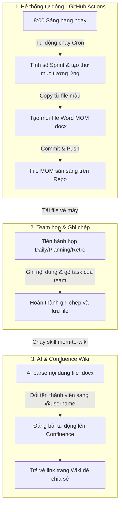

# Quy Trình Tự Động Hóa MOM (Minutes of Meeting)

Quy trình này giúp tự động hóa việc khởi tạo, ghi chép và đồng bộ biên bản cuộc họp (MOM) lên Confluence Wiki, giảm thiểu thao tác thủ công cho team.

---

## 1. Vấn đề (Pain Points)

Trước khi áp dụng tự động hóa, team gặp một số khó khăn sau:
* **Mất thời gian chuẩn bị:** Đầu mỗi ngày hoặc mỗi buổi họp (Daily, Planning, Review + Retrospective), mọi người phải vào File Explorer để copy-paste thủ công từ file mẫu để tạo file MOM mới.
* **Nhập liệu thủ công:** Phải đọc và gõ lại toàn bộ task từ group Daily standup nội bộ vào file MOM.
* **Miss thông tin:** Việc vừa tập trung nghe thảo luận vừa phải cặm cụi nhập lại task khiến người ghi chép dễ bị sót các thông tin chi tiết hoặc nội dung quan trọng khác của buổi họp.

---

## 2. Giải Pháp Hiện Tại (Current Solutions)

Để giải quyết vấn đề trên, quy trình mới đã tự động hóa được khoảng **50% công việc**:

### Tự động tạo file MOM theo Sprint
* Hệ thống sử dụng GitHub Actions workflow [.github/workflows/daily-mom.yml](file:///d:/baihoc/Pet%20project/MoM_Schedule_Process/.github/workflows/daily-mom.yml) để tự động chạy vào lúc **8:00 sáng (giờ Việt Nam)** từ thứ 2 đến thứ 6 hàng tuần.
* Workflow tự động tính toán số Sprint hiện tại (chu kỳ 2 tuần), tạo cấu trúc thư mục tương ứng và copy file từ template chuẩn:
  * **Thứ 2 đầu Sprint (Tuần 1 - Day 0):** Tạo file `SprintPlanning_*.docx`.
  * **Thứ 6 cuối Sprint (Tuần 2 - Day 11):** Tạo file `ReviewAndRetro_*.docx`.
  * **Hàng ngày (Thứ 2 - Thứ 6):** Tạo file `DailyMeeting_*.docx`.
* Sau khi tạo, GitHub Actions tự động commit và push file lên repository.

### Đồng bộ lên Confluence Wiki
* Sử dụng skill [CLAUDE.md](file:///d:/baihoc/Pet%20project/MoM_Schedule_Process/MOM-to-wiki/CLAUDE.md) để phân tích file `.docx` cuộc họp đã hoàn thành.
* Tool tự động trích xuất các thông tin quan trọng: dự án, ngày họp, thành viên tham gia, action items, task chi tiết, và nội dung retro.
* Tool đối chiếu tên thành viên và tự động map sang định dạng `@username` của Confluence, sau đó publish trực tiếp lên Confluence Wiki (Space MS).

---

## 3. Luồng Hoạt Động Chi Tiết (Detailed Workflow)

Để dễ hình dung, quy trình này được chia thành 3 giai đoạn rõ ràng tương ứng với 3 nhóm vai trò khác nhau:

### Giải thích chi tiết các bước:
1. **Chuẩn bị (Tự động hoàn toàn):** Đúng 8:00 sáng, GitHub Actions tự động kiểm tra xem hôm nay là ngày thứ mấy của Sprint để tạo đúng file biên bản mẫu cần thiết (Planning vào thứ 2, Retro vào thứ 6, Daily các ngày còn lại). File này sau đó được đẩy lên repo để team lấy ra dùng.
2. **Họp & Ghi chép (Team thực hiện):** Team tải file biên bản vừa được tạo ở bước 1 về, tiến hành họp và điền thông tin (task đã làm, task đang làm, các vấn đề phát sinh).
3. **Đẩy lên Wiki (AI hỗ trợ):** Sau khi họp xong, thành viên phụ trách chạy skill `mom-to-wiki` qua Claude Code. AI sẽ tự động đọc hiểu file Word, chuyển đổi định dạng, đổi tên mọi người sang tag Confluence (ví dụ: `Võ Quốc Huy` thành `@huy.vo`) và publish trực tiếp lên Wiki của NDSVN. Cuối cùng, AI trả lại link trang Wiki để team gửi vào group chat báo cáo.

---

## 4. Các Điểm Cần Lưu Ý (Pitfalls & Edge Cases)

* **Tên thành viên mới:** Bảng map tài khoản nằm trong [CLAUDE.md](file:///d:/baihoc/Pet%20project/MoM_Schedule_Process/MOM-to-wiki/CLAUDE.md). Nếu có thành viên mới gia nhập team, cần cập nhật username của họ vào bảng này để tool có thể tag chính xác trên Wiki.
* **Định dạng file:** Tool phân tích dựa trên cấu trúc template sẵn có. Việc chỉnh sửa quá nhiều cấu trúc bảng biểu trong file `.docx` gốc có thể khiến tool parse thiếu thông tin.

---

## 5. Bước Tiếp Theo (Next Actions)

Để tiến tới tự động hóa hoàn toàn và nâng cao chất lượng thông tin, các bước tiếp theo cần triển khai gồm:

1. **Thu thập task từ Gapowork:**
   * Nghiên cứu API hoặc cơ chế thu thập tin nhắn từ nền tảng chat nội bộ Gapowork.
   * Tự động lọc và trích xuất các task mà thành viên đã gửi trong group chat để đưa vào MOM mà không cần gõ lại. Người ghi chép sẽ rảnh tay để tập trung note sâu các thảo luận quan trọng.
2. **Tự động hóa toàn trình (Auto-schedule & Notify):**
   * Thiết lập lịch trình để AI tự động quét file `.docx` mới nhất mỗi ngày, kích hoạt skill `mom-to-wiki` để đẩy lên Confluence mà không cần người dùng gõ lệnh thủ công.
   * Sau khi publish thành công, AI tự động lấy link trang Wiki và gửi tin nhắn thông báo kèm link vào group chat của team.
